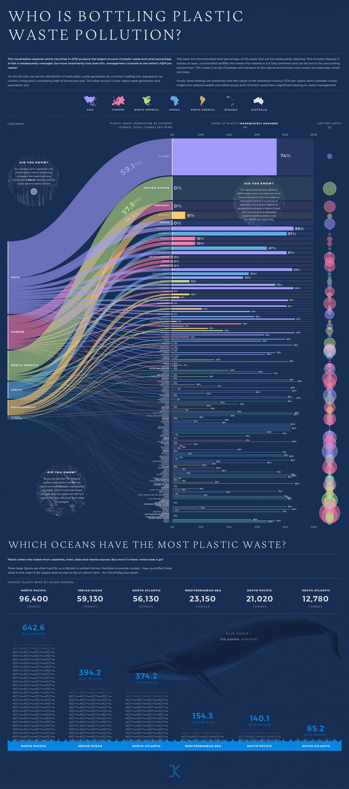

# Week 1 Visualization

## Visualization and Source

[Source](https://www.behance.net/gallery/106936329/Plastic-Waste-Pollution-data-visualisation)

## Reflection

I liked this visualization, as it provided a clear overview of plastic waste pollution in our oceans, while also providing more details to the viewer as you more closely inspect the visualization.

The countries are clearly separated, and the visualization shows different relations in the data.
The data includes information on plastic waste generation in tonnes per year, GDP per capita of the relevant country, and the percentage of that country's plastic waste that is *inadequately managed*.

One gripe I have with this visualization, is that it is not very good at showing whether the GDP per capita of a country has an effect on the percentage, or total amount of plastic waste accumulated.

The visualization shows both of these stats, but the visualization of GDP per capita makes it difficult to get an exact value, or compare multiple countries.

The visualization also does not offer any insight on the population of the countries.

This could provide insight on whether larger countries are more or less efficient in managing / reducing production of plastic waste than smaller countries, or vice versa.

Including population is also a big factor, as if one country produces a lot less plastic waste than another, but mismanages more of it, if these two countries have similar populations it could be that the net total mismanaged plastic waste is less for the first country per capita, but the visualization would not effectively display this.

These factors could be important when deciding to examine the culture and systems in place in low-waste countries to mimic these in countries that produce higher amounts of plastic waste.

Another place the visualization fell a little bit short, is if you are trying to examine one country in particular. 

While the visualiaztion provides a decent overview of a lot of data, if you want to see more specific data, it becomes difficult to follow the overlapping lines.

I believe that some of these problems could be solved by creating some kind of interaction with the user, where they can filter out portions of the bipartite and make it easier to view.
