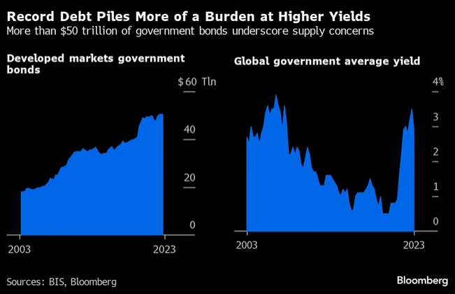
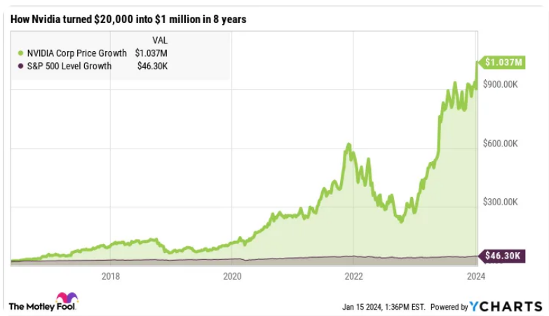
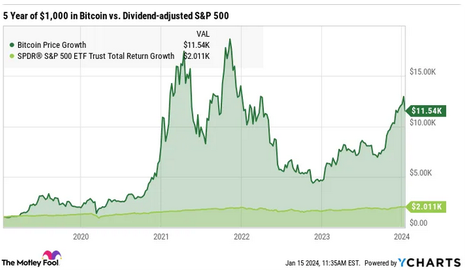

**Reflection 1**

**Motivation:** Search for easy and simple to understand visualizations that informs about current, past, and future market trend. 

1. [Figure 1: Surging Debt Supply to Boost Global Yields, Goldman Sachs Says](https://finance.yahoo.com/news/surging-debt-supply-boost-global-022308654.html)

    

2. [Figure 2: Could Investing $20,000 in Nvidia Make You a Millionaire?](https://finance.yahoo.com/news/could-investing-20-000-nvidia-113700970.html)

    

2. [Figure 3: If You Invested $1,000 in Bitcoin 5 Years Ago, This Is How Much You'd Have Now](https://finance.yahoo.com/news/invested-1-000-bitcoin-5-193700718.html)

    

**Observations:**

    1. Figure 1 is a dual-chart graphic from Bloomberg that illustrates the growth in government debt and the corresponding yield from 2003 to 2023.
        - The first chart shows a steep rise in the volume of bonds in the market, indicating a significant increase in government borrowing.
        - The second chart shows a sharp rise in yields, reaching around 4%, indicating a significant increase in the overall cost of borrowing.
        - The chart and analysis suggest an increase in medium-term yields.
        - The figure and the write-up complement each other, making it easier for readers to understand the bottom line. Financial market analyses are often challenging to comprehend for many people, including myself. Simple yet informative analyses like this are as important as more complex visualizations.

    2. Figure 2 is a typical chart seen in financial news feeds. It shows NVIDIA's stock performance over the past 8 years compared to the S&P 500. This chart, often used by subscription-based analytics services like "The Motley Fool," typically ends with a cliffhanger to discuss high-performing stocks. While not overly complicated, the chart could be improved with callouts for major global events that explain steep increases and decreases. Additionally, the comparison only includes the S&P 500, requiring readers to do extra research for a more comprehensive analysis.

    3. Figure 3 is a similar chart for cryptocurrency, comparing Bitcoin's performance with the S&P 500 over the past 5 years. The article selectively highlights facts, as the comparison would differ if it covered the last 3 years. I included this chart as part of my exploration of financial news and analysis.

**References:**

    1. [Surging Debt Supply to Boost Global Yields, Goldman Sachs Says](https://finance.yahoo.com/news/surging-debt-supply-boost-global-022308654.html)

    2. [https://finance.yahoo.com/news/could-investing-20-000-nvidia-113700970.html](https://finance.yahoo.com/news/could-investing-20-000-nvidia-113700970.html)

    3. [https://finance.yahoo.com/news/invested-1-000-bitcoin-5-193700718.html](https://finance.yahoo.com/news/invested-1-000-bitcoin-5-193700718.html)

