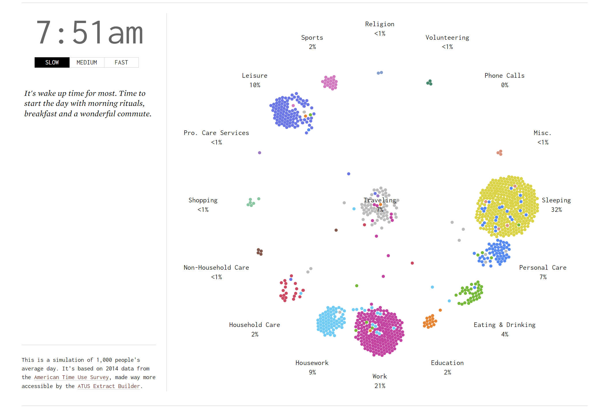

# Week 1 Visualization

## Visualization and Source

[Source](https://flowingdata.com/2015/12/15/a-day-in-the-life-of-americans/)

## Reflection

I liked this visualization as it provided an interesting and fun
view of the daily life of an average American.

The visualization displays data by minute, taken from a
survey, named the American Time Use Survey and simulates the
percentage of people in each activity during each part
of the day.

This survey was taken in 2014, and recorded the responses of US
citizens between the age of 24 and 35. It can be found [here](https://www.bls.gov/tus/)

The visualization also offers a fast, medium and slow pace to
traverse through the day.

Additionally, on the side of the interactive visualization, the
author has included some interesting explanations for some
possible reasons and statistics on why people are transitioning
between different activities.

I also enjoyed that in the surrounding explanation of the
visualization, the author explains some of the more interesting
transitions as well.

The brightly colored sections of the visualizations also help to
distinguish the individual sections of activity.

One design choice I was unsure of, was why the creator of the
visualization decided to put "traveling" in the middle of the
circle.

I believe this may be because it was intended that "traveling"
would be an in between section of the other sections of activity.

One part that I feel this visualization was missing was a pause
functionality, as well as a scrub functionality to explore
the different times more in-depth.

I believe that without these functionalities it is a little bit
more tedious if you want to look at certain portions of the day.
