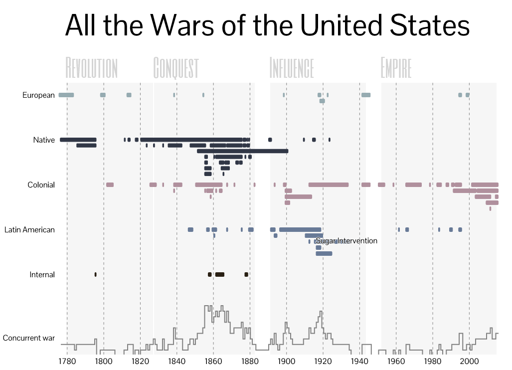
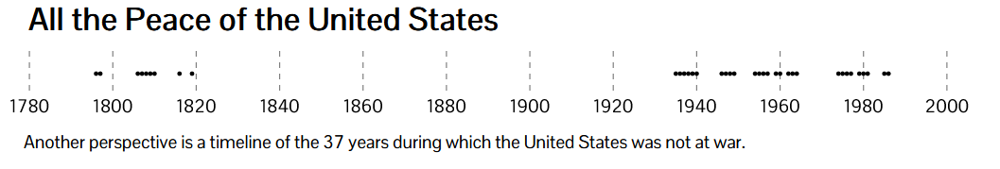

**Reflection 2**

**Motivation:** Search for easy and simple to understand visualizations that narrates multiple events in a timline 

1. [Figure 1: Interactive Timeline of All the Wars of USA](http://elijahmeeks.com/wars/)

    

2. [Figure 2: Frequency and Timline of Peacetime](http://elijahmeeks.com/wars/)

    

**Observations:**

I am very interested in learning US Military History. However, I do not always remember the timeline of major events / conflicts. 
This map seemed very simple yet captured important details. This interactive visualiation divides U.S. military engagements into horizontal categories. The temoral representation is also further dividied into 4 lables based on the scale and reasons for the wars. The historical phases makes it easier to group these events while interacting with the visualization. The color coding are simple that separates categories and labels. Figure 2, shows the inverse of figure 1 using simple visualization techniques of dot marker on the timeline that allows readers to quickly access the frequency and duration. 

**References:**

    1. [All the Wars of the United States](http://elijahmeeks.com/wars/)

    2. [The Great War: A Visual History](https://www.abmc.gov/sites/default/files/interactive/interactive_files/WW1/index.html)

