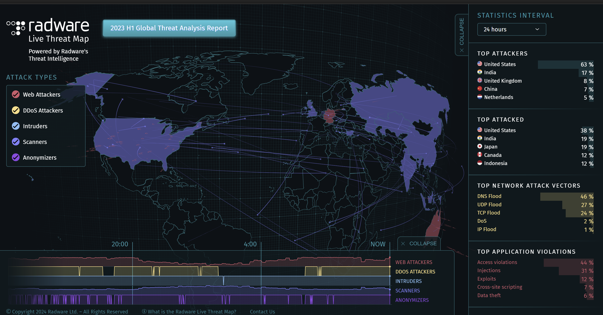
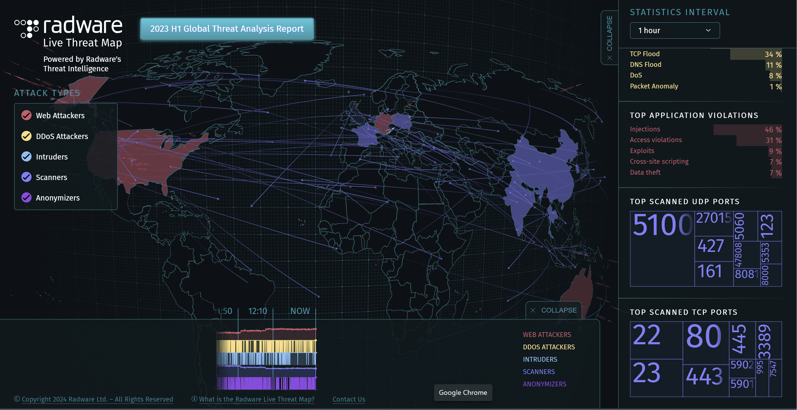

# Week 3 Visualization

[Source](https://livethreatmap.radware.com/)

## Reflection

I liked this visualization as it provided a fun visual of (supposedly) live threats going on
in multiple countries.

It provides a view of the world, and provides a good view of the origin and destination of
attacks.

I also like the hovering functionality of the map, as it shows which country is being hovered
over, which is useful if you are bad at geography like I am.

The visualization also splits the attacks into multiple geographical sections, such as in
top attackers, and top attacked.

I also like how the visualization also listed different kinds of attacks, and ranked the highest
amount of network attack vectors and top application violations as well as the most
commonly scanned UDP and TCP ports.

I also like the 3d element of the visualization, as the points and trails from one country
to another makes it easy to see what is going on at a glance.

I think that the globe view is a little misleading, however, as it is slightly curved which
does not match the earth's curvature.

I feel it would have been better to just not include a curvature as this representation
is unnecessarily misleading to the end user.

I do think that there is a significant bias in this visualization, however, as we
must take into consideration both the source of the visualization, and the information
in the visualization.

The source of the visualization is a security company (Radware), so it is very likely that
they overestimate their data and display things that many would not categorize as attacks
as attacks in their visualization.

It is also likely that a good chunk or all of the visualization is simply simulated information.

Finally, if the data is real, we must also remember that when making a visualization like this,
the amount of data on the map is only the detected threats, and many more threats are
actually occurring that are undetected.
