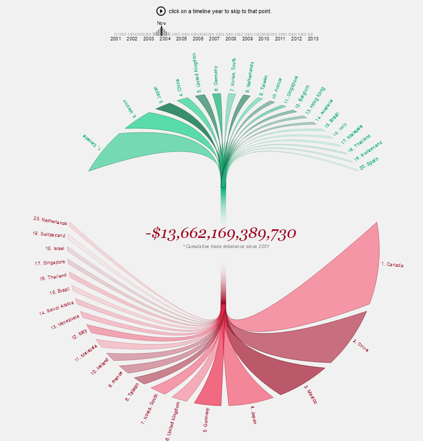
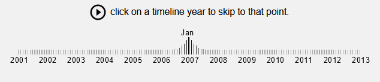

**Reflection 3**

1. [United States Trade Deficit](http://www.brightpointinc.com/united-states-trade-deficit/?source=post_page-----43fc3428a27e--------------------------------)

    

2. 

**Observations:**
- Visualization depicts the United States trade deficit from period of 2001 to 2013. 
- It presents insights into top 20 trading partners while distinguishing imports and exports. 
- Design seemed very pleasing and easy to read. 
- The slider with timeline seems to be a good approach of story telling. 
- The mouseover aspects gave more interactivity with the figure for any additional details. 
- Despite not being current, the visualization is very informative. 
- Color schemes of green and red is a classic and works well. 
- The visualization was clear to understand in terms of its use, and intreactive features. 

**References:**

1. [United States Trade Deficit](http://www.brightpointinc.com/united-states-trade-deficit/?source=post_page-----43fc3428a27e--------------------------------)
