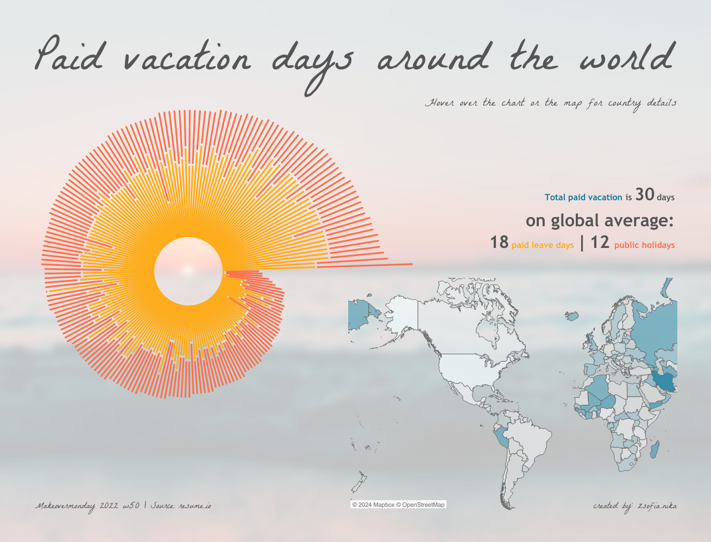

**Reflection 3**

1. [Paid Vacation Days Around the Worlk](https://public.tableau.com/app/profile/zsofia.nika/viz/Whichcountrygetsthemostpaidvacationdays_16711136524000/Vacation)

    

**Observations:**
- This particular visualization was voted as the "Visualization of the Day" in 2022. Though simple, the interactive visualization seemed to capture the overall essence effectively. The visualization has 3 distinct areas for interaction and information output. First is the world map that is interactive. It lets users hover or click on a country to get information on the top right and left portions of the screen. This area also supports a search box for quicker queries. The second area displays the text "total paid vacation days" that is broken down into paid leave days and public holidays. The third area is something that really brings out the creative side; it is a circular legend (chart) and summary that is ordered in ascending order of the total number of paid vacation days. This particular visualization is also interactive, and overall, the reason it piqued my interest. The color scheme is well-chosen and seemed balanced, giving a better aesthetic. I encountered a few bugs when interacting with the chart and map areas that were related to the proper loading of data. Overall, I felt this visualization hit the spot in getting the viewer's attention and educating them about the topic.  

**References:**

1. [Paid vacation days around the world](https://public.tableau.com/app/profile/zsofia.nika/viz/Whichcountrygetsthemostpaidvacationdays_16711136524000/Vacation)
