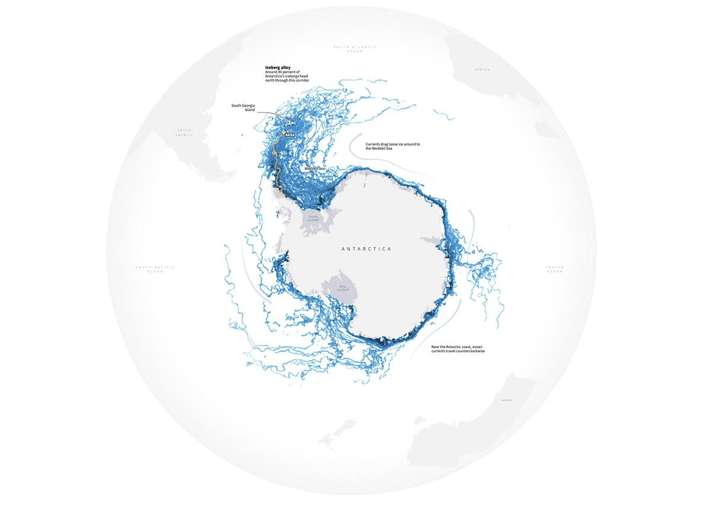

# Week 4 Visualization

*note: this is better viewed on the actual website below

[Source](https://www.reuters.com/graphics/CLIMATE-CHANGE/ICEBERG/yzdvxjrbzvx/index.html)

## Reflection

I liked this visualization as it showed a very clear view of 
antarctic iceberg drift and loose ice drift, and talks about how
this iceberg is taking a path common for icebergs that break off
of Antarctica.

I liked the color schemes that were chosen, as they portray
the context of the situation well.

I also liked the arrows that show direction around Antarctica
to show which way the currents were travelling that affect
the icebergs, as in some places it was difficult to see the
paths the icebergs took.

The visualization also gives information on how the currents
around Antarctica act by providing text.

I think the decision to display the information on a map was
a good one, and was a good idea to include not just Antarctica,
but the surrounding land masses, as they are very relevant to
the article

I think the visualization also included important information
such as where various ice shelves were, which helps show the
viewer of the visualization where a lot of the ice comes from.

It also shows the path that the iceberg in question takes
relatively clearly through a highlighted path.

I think, however, that this path could have been emphasized a
bit more, as I almost didn't see it until I was looking for the
path.

I think to do this, they could either change the color /
thickness of the line, or center the iceberg in question's path
so that the viewer's attention naturally gravitates towards it.

I think all in all, paired with the article, the visualization
gave a good overview of what it was trying to show, which was
the path of the iceberg and similar icebergs, as well as the
proximity of the iceberg to South Georgia Island.
