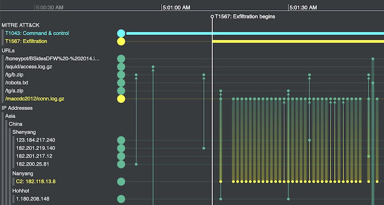

**Reflection 5**

1. [KronoGraph: Timeline Visualization for Anomaly Detection and Investigation](https://cambridge-intelligence.com/kronograph/)

    

**Observations:**
- I came across this product while searching for GANTT chart and other tools for timline representation. There are various other tools that support similar dashboard and graphics such as splunk, security onion etc. At a glance, this tool seemed to support easier to integrate with existing databases for data feeds to create interative graph visualization. This tool can be used not only for cybersecurity data but also with other time-based data to better understand teh outliers and anomalies. For cybersecurity applicaiton, the toool seemed to support baseline comarision of network behavious, pattern recognitin and mapping of devices on the network.  

**References:**

1. [KronoGraph: Timeline Visualization for Anomaly Detection and Investigation](https://cambridge-intelligence.com/kronograph/)