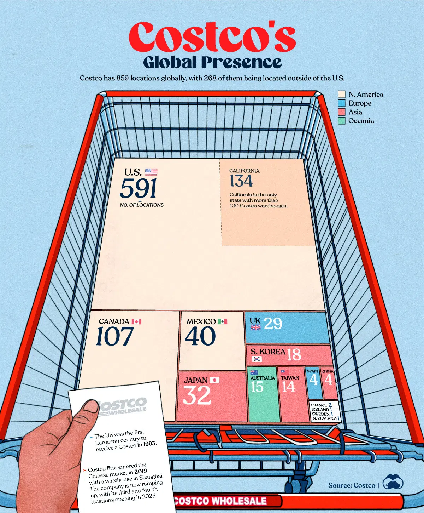

# Week 5 Visualization

[Source](https://posts.voronoiapp.com/business/Visualizing-Costcos-Global-Presence-150)

## Reflection

I liked this visualization as it very clearly shows the amount
of locations that Costco has globally in a fun way.

The visualization engages the user and sticks to a Costco-based
theme, with the visualization itself being created in a
shopping cart.

The visualization also provides some extra relevant facts about
the first time Costco entered foreign markets such as the UK and
China, shown on a receipt, which also fits the shopping theme.

As can be seen in the visualization, the United States has the 
the greatest amount of Costcos, which makes sense, as the
company originated in America.

The visualization easily shows which countries have the largest
amount of locations, and makes it relatively easy to rank them
by showing the numbers inside the blocks, which I liked.

The visualization makes use of size, by making the blocks of the
countries with more locations larger, and the blocks of the

The visualization makes use of color, by labeling the data by 
continent with each continent having its own color.

This made it easier to envision the geographical space between
the countries, and to group the countries in a meaningful way.

This grouping helps to tell a story of how Costco spread, and
is can create questions such as the reason Costco did well in
Asian countries such as Japan and South Korea, but less well
in European countries.

I think this is a fun and informative way to show the information
and to entice readers into looking at the rest of the article
and exploring the website.
