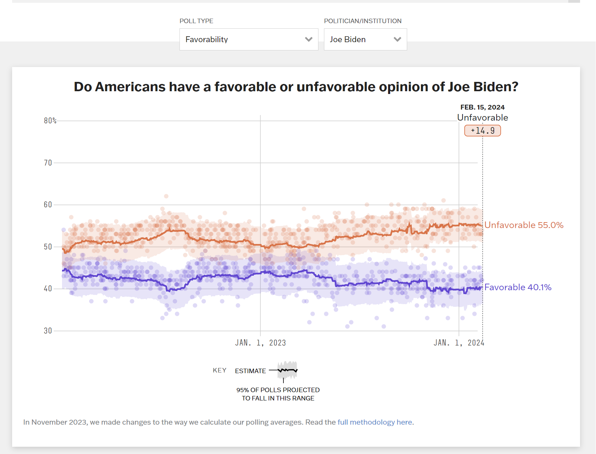

# Week 6 Visualization

[Source](https://projects.fivethirtyeight.com/polls/favorability/joe-biden/)

## Reflection

I think this visualization is an interesting way to show
favorability poll results for different politicians /
institutions.

The graph shows historical data starting from around Jan 2, 2022
and plots the data on a scatter.

The plot includes an average line of the percentage favorable
and unfavorable which helps the viewer to see how the trend
changes over the years.

I liked this visualization's use of opacity, making the poll
results relatively see-through, but making the average line
very opaque to ensure that it is visible, and stands out to the
user.

The visualization also uses a transparent color to show a
prediction of where the estimated 95% of polls will be, which
is also helpful in assisting the viewer in recognizing the
trends of the data.

I also liked the interactive points of the visualization as well.

As the user hovers over the visualization, the user can see
the percentage favorable and unfavorable for any date they
want by changing their mouse position.

I think that this is implemented well, as it includes a line
for a more precise view of the specific date, as well as labels
for that specific date.

These consist of the overall trend (favorable or unfavorable),
the percentage up that the trend is showing (+5.0 favorable),
and the percentages that the favorable and unfavorable averages
are at on that date.

The visualization also changes the opacity of the average
lines in the future on the visualization, which helps to
emphasize the date the viewer is exploring.

I think without this opacity change, it would be more difficult
to see the date that is being observed in relation to position
on the graph, even with the dotted vertical line.

The visualization also includes a dropdown where you can select
different politicians and see their favorability poll ratings
over time.

Overall, I think that this visualization does a very good job
displaying the changes in the poll ratings over time, as well
as the current poll ratings.
