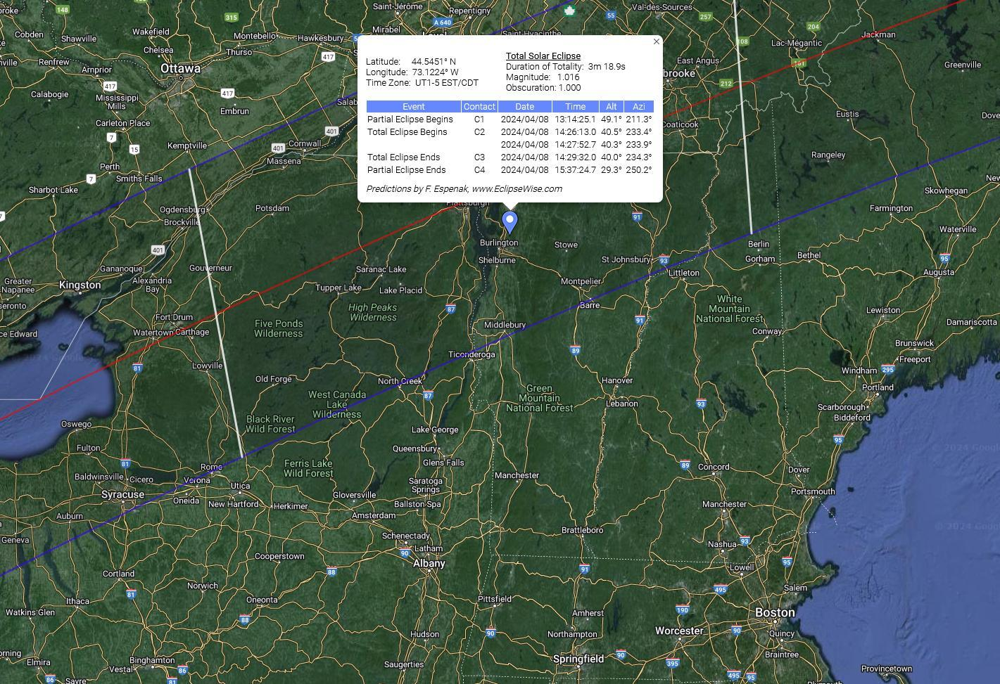
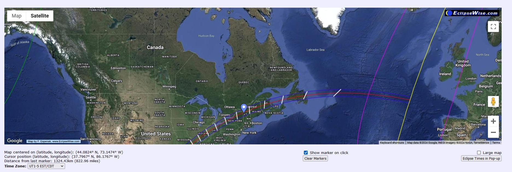

**Reflection 6**

1. [Google Eclipse Map: Plan for Total Solar Eclipse of 2024 on 08 APR](https://eclipsewise.com/solar/SEgmapx/2001-2100/SE2024Apr08Tgmapx.html)

    
    

**Observations:**
- I got steered towards planning tool for total solar eclipse event of 2024 based on my news feed this morning. Eclipsewise's website provides an excellent visualization tool for the Total Solar Eclipse of April 8th, 2024. Their interactive Google map offers functionality for trip planning, allowing users to zoom, scroll, and click on any location to generate precise eclipse predictions. 

Features:
    Regional Path: The map clearly visualizes the path of totality (umbra) and areas of partial visibility (penumbra).

    Reference Map: A small global map gives context to the overall eclipse visibility.

    Eclipse Circumstances: Provides eclipse details specific to your chosen location.

    Sunrise/Sunset Data: Shows where the eclipse occurs at sunrise/sunset, aiding in viewing decisions.

    Weather Emphasis: Stresses the importance of clear skies for optimal viewing.

    User-Friendly Interface: The map is intuitive, making it easy for users of all levels to navigate.

    Key Information: Eclipse duration and points of special interest are clearly marked.

    Customization: The ability to plot points and get coordinates enhances trip planning.
    

**References:**

1. [Google Eclipse Map: Plan for Total Solar Eclipse of 2024 on 08 APR](https://eclipsewise.com/solar/SEgmapx/2001-2100/SE2024Apr08Tgmapx.html)
