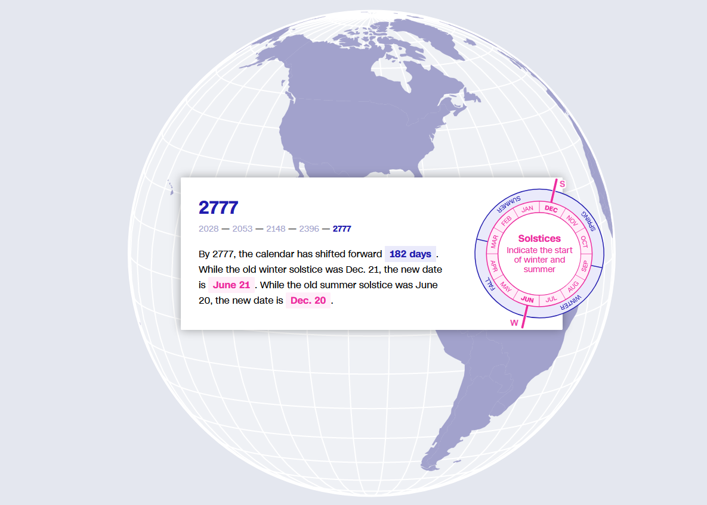
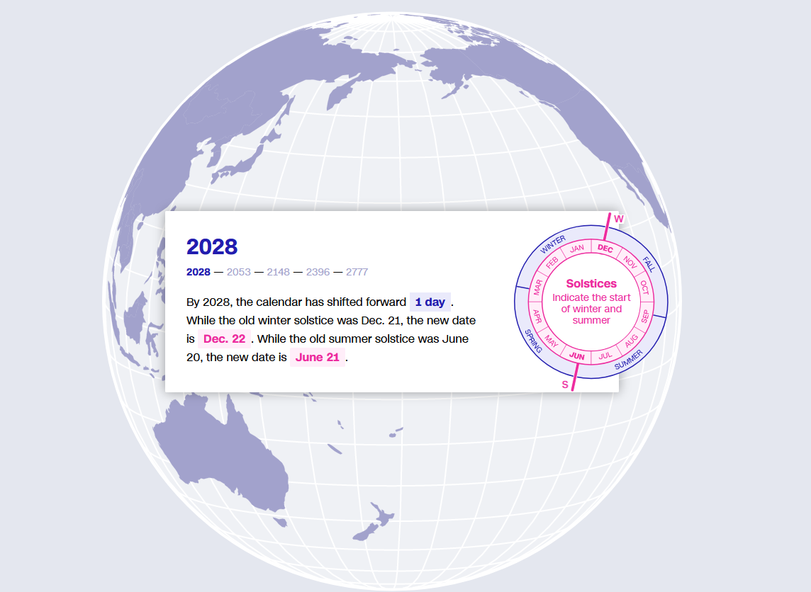

**Reflection 6**

1. [What would happen if we didn’t have leap years?](https://www.cnn.com/interactive/2024/02/world/leap-year-meaning-explained-dg-scn/)

    
    

**Observations:**
This informations could be turned into a simple table but the visualization grabs the attention of readers to show how ommision of leap year can change our calendar where it will shift the days for seasons in few centuries.  

**References:**

1. [What would happen if we didn’t have leap years?](https://www.cnn.com/interactive/2024/02/world/leap-year-meaning-explained-dg-scn/)
